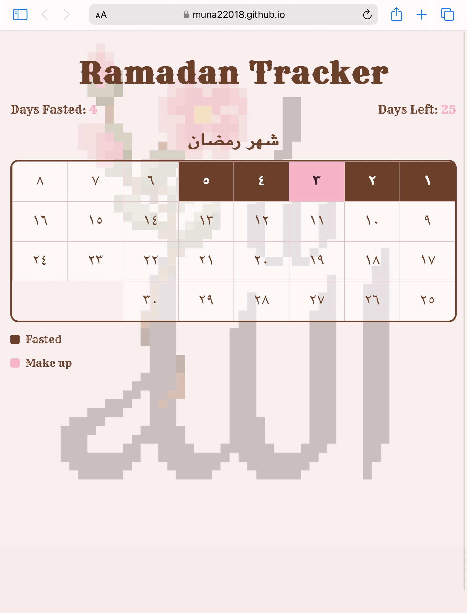

# Ramadan-Tracker
Track how many days you've fasted in the month of Ramadan!

This is a Ramadan fasting tracker built with HTML, CSS, and JavaScript.

Built to help track your progress throughout the month of Ramadan, all in a clean aesthetic design inspired by traditional islamic aspects.

---

## Features

- 30-day Ramadan grid layout
- Arabic numerals for calendar days
- Brown fasted and pink Make-up days for tracking
- Saves progress using localStorage
- installable as a desktop app (PWA)
- Custom pixel-style app icon

---

## Live Demo

https://muna22018.github.io/Ramadan-Tracker/

---

## Built With

- HTML
- CSS
- JavaScript
- Web App Manifest (for installable app support)
- GitHub Pages (deployment)

---

## Preview

---

## How It Works

- Each day stores a state: '"none"', '"fasted"', or '"make-up"'.
- The tracker dynamically updates:
    - Days Fasted
    - Days Left
- Data is saved locally in the browser using 'localStorage'

---
